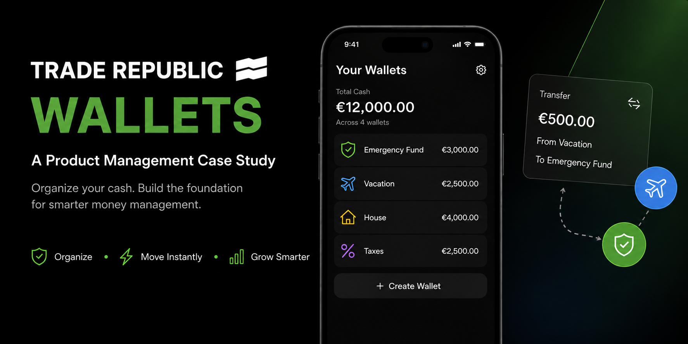
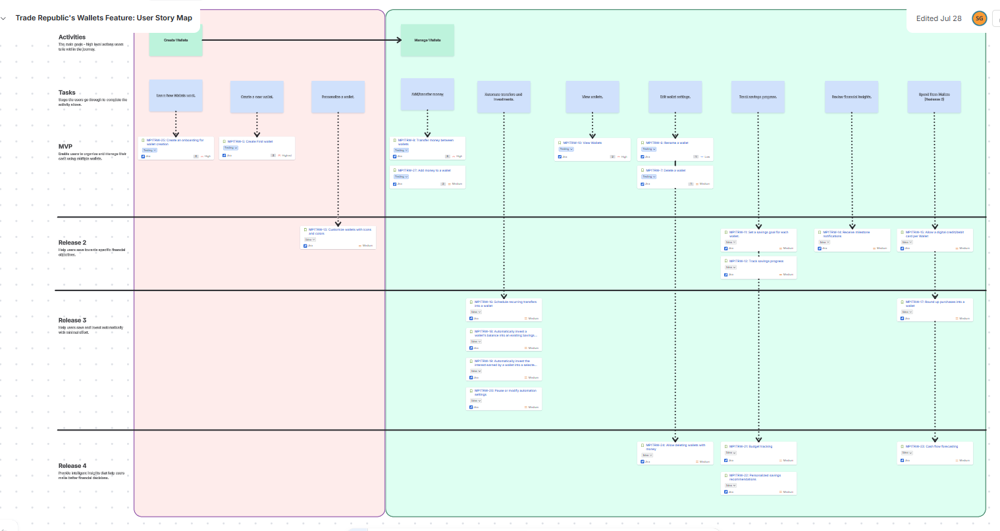
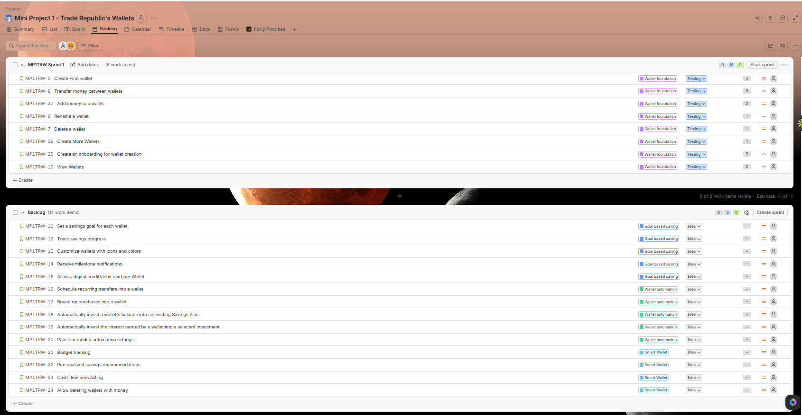

<p align="center">
  
</p>

<h1 align="center">💳 Trade Republic Wallets</h1>

<p align="center">
A Product Management Case Study exploring how Trade Republic could help customers organise their money through virtual wallets while increasing engagement and cash retention.
</p>

<p align="center">
Created as part of the <strong>Ironhack AI Product Management Bootcamp</strong>
</p>
<p align="center">

<a href="https://www.figma.com/deck/CbmhLF89mXpIX5BGQeIlEv">

</a>

<a href="https://www.figma.com/proto/C83Q4PnidJIeDFwOhLWVto/Trade-Republic-Wallets---Prototype?node-id=1-4&t=mGgzJlsnuueg1NX8-1&scaling=scale-down&content-scaling=fixed&page-id=0%3A1&starting-point-node-id=1%3A4&show-proto-sidebar=1">

</a>

<a href="docs/Trade_Republic_Wallets_PRD.pdf">

</a>

</p>
---

# 📖 Overview

Managing money for multiple financial goals can quickly become overwhelming when all available cash sits in a single balance. Although Trade Republic provides an excellent investing experience, customers currently have limited ways to organise their savings without relying on external budgeting tools or additional bank accounts.

In this case study, I explored how introducing **Virtual Wallets** could simplify everyday money management while strengthening customer engagement and supporting Trade Republic's long-term product strategy.

---

# 🚀 Project at a Glance

| | |
|---|---|
| 🏦 Product | Trade Republic Wallets |
| 🎯 Objective | Help users organise savings while increasing customer cash retention |
| 👥 Target Users | Retail investors with multiple savings goals |
| 📱 Platform | Mobile App |
| 🏷️ Industry | FinTech |
| 📦 MVP | Wallet Creation, Wallet Management, Internal Transfers |
| 🛠 My Role | Product Discovery, PRD, Story Mapping, Roadmap, Jira Backlog & Prototype |
| 🚀 Future Vision | Goal-Based Saving • Wallet Automation • Smart Financial Insights |

---

# 🎯 The Problem

Trade Republic currently stores all uninvested cash in a single balance.

For customers saving toward multiple goals—such as an emergency fund, holiday, home deposit, or taxes—it becomes difficult to understand how much money belongs to each purpose.

Many customers solve this by:

- Opening multiple bank accounts
- Using budgeting applications
- Tracking savings in spreadsheets

While these workarounds help users organise their finances, they also reduce engagement with the Trade Republic platform and encourage funds to move elsewhere.

---

# 💡 The Solution

I proposed a **Wallets** feature that allows customers to organise their money into multiple virtual wallets without opening additional bank accounts.

Instead of creating separate accounts, customers can simply allocate money into dedicated wallets such as:

- 🏖 Vacation
- 🚗 Car Fund
- 🛟 Emergency Fund
- 🏠 Home Deposit
- 📈 Investment Budget

### MVP Features

- Create Wallets
- Rename Wallets
- Delete Empty Wallets
- Add Money
- Transfer Between Wallets
- View Wallet Balances

The MVP intentionally focuses on solving one clear customer problem: **helping users organise their savings in a simple and intuitive way.**

---

# 👤 Primary User

### Sarah — Goal-Oriented Saver

Sarah regularly invests using Trade Republic but also saves for several life goals.

Today she manages these goals using multiple banking apps and spreadsheets.

Her biggest need is simple:

> **"I want one place where I can organise my savings and investments without juggling multiple accounts."**

---

# 🎯 Product Goals

The Wallets feature was designed to balance customer value with business objectives.

### Customer Goals

- Organise money by financial goal
- Separate savings from investment funds
- Move money easily between wallets
- Manage finances from one platform

### Business Goals

- Increase customer cash balances
- Improve engagement with cash management
- Increase customer retention
- Build the foundation for automated savings

---

# 📊 Success Metrics

Rather than measuring engineering output, success is defined through customer adoption and business impact.

| KPI | Target |
|------|---------|
| Wallet Adoption | ≥30% within 3 months |
| Average Wallets per User | ≥2 |
| Average Cash Balance | +10% |
| Monthly Active Users | +15% |
| Customer Retention | +8% |

---

# 🛣 Product Process

This project followed an end-to-end Product Management workflow.

```text
Problem Discovery
        ↓
Research & Personas
        ↓
Opportunity Definition
        ↓
Story Mapping
        ↓
MVP Prioritisation
        ↓
Product Requirements
        ↓
Roadmap
        ↓
Backlog Planning
        ↓
Prototype
```

---

# 🗺 Product Roadmap

### Phase 1 — Wallet Foundation

Build the core experience by allowing customers to create, manage and transfer money between wallets.

### Phase 2 — Goal-Based Saving

Introduce savings targets, progress tracking, wallet personalisation and milestone notifications.

### Phase 3 — Wallet Automation

Enable recurring transfers, round-ups and automatic investment into existing savings plans.

### Phase 4 — Smart Financial Insights

Provide budgeting support, personalised recommendations and cash-flow forecasting.

---

# 🎨 Presentation & Interactive Prototype

The complete project is documented through an interactive presentation that explains the entire Product Management journey—from identifying the opportunity to defining the MVP and designing the product experience.

### The presentation includes

- Product Vision
- Problem Analysis
- User Persona
- Proposed Solution
- User Journey
- Story Mapping
- MVP Scope
- Product Roadmap
- Business Impact
- Interactive Prototype

### 🔗 Figma Presentation

📊 **[View Presentation](https://www.figma.com/deck/CbmhLF89mXpIX5BGQeIlEv)**
### 🔗 Interactive Prototype

📱 **[Launch Prototype](https://www.figma.com/proto/C83Q4PnidJIeDFwOhLWVto/Trade-Republic-Wallets---Prototype?node-id=1-4&t=mGgzJlsnuueg1NX8-1&scaling=scale-down&content-scaling=fixed&page-id=0%3A1&starting-point-node-id=1%3A4&show-proto-sidebar=1)**

---

# 📄 Project Deliverables

This repository contains the complete set of Product Management artefacts created during the project.

## 📑 Product Requirements Document

The PRD includes:

- Product Vision
- Problem Statement
- Business Goals
- Functional Requirements
- Non-functional Requirements
- User Stories
- Success Metrics
- Risks & Trade-offs
- Future Roadmap

📄 **[View Product Requirements Document (PRD)](docs/Trade_Republic_Wallets_PRD.pdf)**

---

## 🗺 Story Map

The Story Map was created to:

- Understand user activities
- Break work into tasks
- Define the MVP
- Prioritise releases

  <p align="center">
  
</p>

📄 **[View Story Map](images/story-map.png)**

---

## 📋 Jira Backlog

The backlog contains:

- Epics
- User Stories
- Acceptance Criteria
- Sprint Planning
- Release Planning

<p align="center">
  
</p>

📄 **[View Jira Backlog](images/jira-backlog.png)**

---

# 🛠 Skills Demonstrated

Throughout this project I applied Product Management practices commonly used by cross-functional product teams.

- Product Discovery
- Product Strategy
- Opportunity Assessment
- User Research
- Customer Personas
- User Journey Mapping
- Story Mapping
- User Story Writing
- MVP Definition
- MoSCoW Prioritisation
- Product Roadmapping
- KPI Definition
- Agile Planning
- Backlog Management
- PRD Writing
- UX Thinking
- Interactive Prototyping
- Stakeholder Communication

---

# 🧰 Tools

- Figma
- Jira
- Confluence
- Miro
- Google Slides
- ChatGPT

---

# 📸 Repository Contents

This repository includes:

- 📄 Product Requirements Document
- 🗺 Story Map
- 📋 Jira Backlog
- 🎨 Interactive Presentation
- 📱 Clickable Prototype

---

# 💭 Reflection

This project gave me the opportunity to experience the full Product Management lifecycle—from identifying a customer problem to designing and presenting a validated product solution.

One of the biggest lessons was understanding that a successful MVP isn't about delivering every possible feature. It's about solving one important problem well and validating that customers find value before expanding the product.

Features such as Goal-Based Saving, Wallet Automation and Smart Financial Insights were deliberately moved into future releases so the MVP could remain focused, achievable and measurable.

If I continued this project, my next step would be validating the concept through usability testing, customer interviews and behavioural analytics before investing in additional functionality.

---

# 👥 Team

This project was developed collaboratively by:

- **Sakshi Gaur**
- **Inder**
- **Jose Manuel**

---

# 📌 Disclaimer

This repository showcases an educational Product Management case study completed during the **Ironhack AI Product Management Bootcamp**.

Trade Republic and its branding are referenced solely for educational purposes. This project is independent and is **not affiliated with, endorsed by, or sponsored by Trade Republic.**
